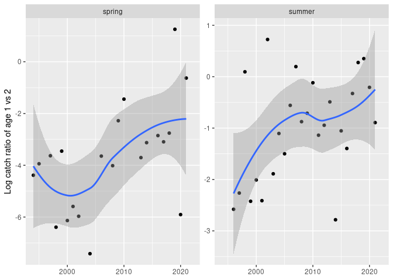
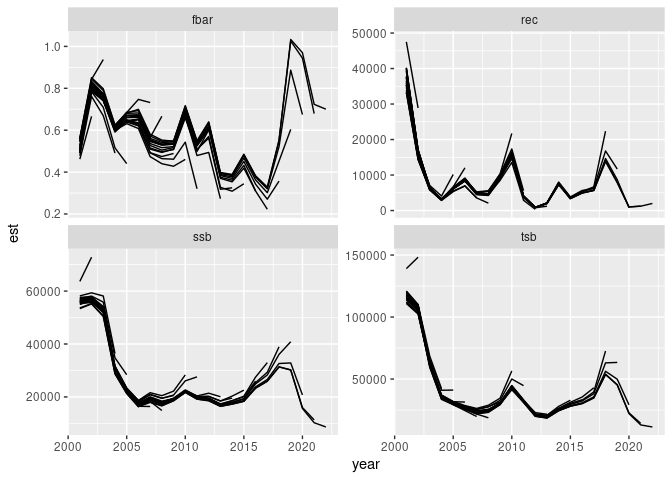
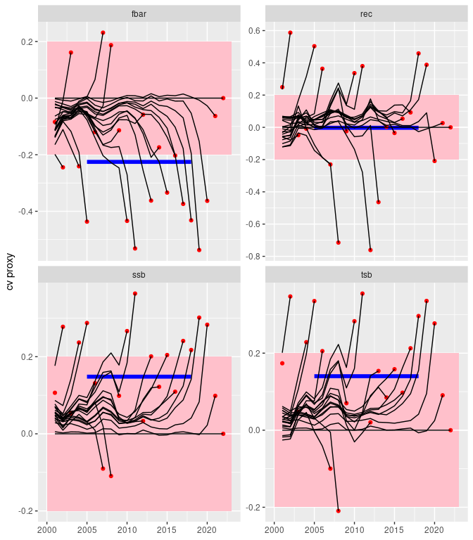

## fcod alternative assessment

- Drop age 1 in the input data
- Use default sam settings - at least in the base run

Running stuff:

- The code for the assessment run is found in R/fcod_base.R
- The results are in run:
  - fit.rds
  - retro.rds

<!-- README.md is generated from README.Rmd. Please edit that file -->

``` r
library(tidyverse)
# remotes::install_github("einarhjorleifsson/fishivce")
library(fishvice)

# The NWWG 2022 fall run (not to be confused with the ipb)
fit.nwwg2022 <- sam_get_fit("Cod_27_5b1")
rbx.nwwg2022 <- sam_rbx(fit.nwwg2022)
opr.nwwg2022 <-
  rbx.nwwg2022$opr |>
  mutate(fleet = case_when(str_sub(fleet, 1, 2) == "SP" ~ "spring",
                           str_sub(fleet, 1, 2) == "SU" ~ "summer",
                           TRUE ~ fleet),
         o = exp(o),
         p = exp(p))

# base run:
fit <- read_rds("run/fit.rds")
retro <- read_rds("run/retro.rds")
rbx <- sam_rbx(fit)
rby <- 
  rbx$rby |> 
  mutate(year = ifelse(variable == "rec", year - 1, year))
rbya <-
  rbx$rbya |>
  mutate(yc = year - age)
rbya.wide <- 
  rbya |> 
  select(-yc) |> 
  spread(variable, val)
opr <-
  rbx$opr |>
  mutate(fleet = case_when(str_sub(fleet, 1, 2) == "SP" ~ "spring",
                           str_sub(fleet, 1, 2) == "SU" ~ "summer",
                           TRUE ~ fleet),
         o = exp(o),
         p = exp(p))

# base retro:
retro <- read_rds("run/retro.rds")
assyears <- 2021 - 0:(length(retro) - 1)
rby.retro <- map(retro, sam_rby)
rbya.retro <- map(retro, sam_rbya)
opr.retro <- map(retro, sam_opr)
names(rby.retro)  <- names(rbya.retro) <- names(opr.retro) <- assyears

rby.retro <- 
  bind_rows(rby.retro, .id = "assyear") |> 
  mutate(assyear = as.integer(assyear)) |> 
  bind_rows(sam_rby(fit) |> mutate(assyear = 2022L))
```

## The problem

``` r
opr.nwwg2022 |> 
  filter(fleet %in% c("spring", "summer")) |> 
  mutate(yc = year - age) |> 
  arrange(fleet, yc, age) |> 
  group_by(fleet, yc) |> 
  mutate(logU = log(o / lead(o))) |> 
  ungroup() |> 
  filter(age == 1) |> 
  ggplot(aes(year, logU)) +
  geom_point() +
  geom_smooth(span = 0.999) +
  facet_wrap(~ fleet, scales = "free_y") +
  labs(x = NULL, y = "Log catch ratio of age 1 vs 2")
```

<!-- -->

## One solution

``` r
rby.retro |> 
  filter(variable != "catch",
         year > 2000) |> 
  ggplot(aes(year, est, group = assyear)) +
  geom_line() +
  facet_wrap(~ variable, scales = "free_y")
```

<!-- -->

``` r
rby.retro <- 
  rby.retro |> 
  left_join(sam_rby(fit) |> select(year, est2022 = est, variable)) |> 
  mutate(p = log(est / est2022)) |> 
  filter(variable != "catch",
         year > 2000)
bias <- 
  rby.retro |> 
  filter(between(year, 2005, 2018),
         year == assyear) |> 
  group_by(variable) |> 
  summarise(y1 = min(year),
            y2 = max(year),
            sd = sd(p),
            p = mean(p))
```

``` r
ggplot() +
  annotate("rect", xmin = 2000, xmax = 2023, ymin = -0.2, ymax = 0.2, fill = "pink") +
  geom_hline(yintercept = 0, colour = "white") +
  geom_segment(data = bias,
              aes(x = y1, xend = y2, y = p, yend = p),
              colour = "blue",
              lwd = 2) +
  geom_point(data = rby.retro |> filter(year == assyear),
             aes(year, p),
             colour = "red") +
  scale_x_continuous(limits = c(2000, 2023)) +
  geom_line(data = rby.retro,
            aes(year, p, group = assyear)) +

  facet_wrap(~ variable, scales = "free_y") +
  #scale_x_continuous(breaks = seq(2000, 2024, by = 2)) +
  scale_y_continuous(breaks = seq(-3, 3, by = 0.2)) +
  labs(x = NULL, y = "cv proxy")
```

<!-- -->

## Caveats

- We still have some problems, but they are less than what we have seen
  at the NWWG 2022 fall meeting.
  - Should be able to ameleorate some of them with some addition
    tweeking

## Session info

``` r
devtools::session_info()
```

    ## ─ Session info ───────────────────────────────────────────────────────────────
    ##  setting  value
    ##  version  R version 4.2.1 (2022-06-23)
    ##  os       CentOS Linux 8
    ##  system   x86_64, linux-gnu
    ##  ui       X11
    ##  language (EN)
    ##  collate  is_IS.UTF-8
    ##  ctype    is_IS.UTF-8
    ##  tz       Atlantic/Reykjavik
    ##  date     2022-10-25
    ##  pandoc   2.19.2 @ /usr/lib/rstudio-server/bin/quarto/bin/tools/ (via rmarkdown)
    ## 
    ## ─ Packages ───────────────────────────────────────────────────────────────────
    ##  package         * version    date (UTC) lib source
    ##  assertthat        0.2.1      2019-03-21 [1] CRAN (R 4.0.2)
    ##  cachem            1.0.6      2021-08-19 [1] CRAN (R 4.1.0)
    ##  callr             3.7.2      2022-08-22 [1] CRAN (R 4.1.3)
    ##  cli               3.4.1      2022-09-23 [1] CRAN (R 4.2.1)
    ##  colorspace        2.0-3      2022-02-21 [1] CRAN (R 4.1.2)
    ##  crayon            1.5.2      2022-09-29 [1] CRAN (R 4.2.1)
    ##  DBI               1.1.3      2022-06-18 [1] CRAN (R 4.1.3)
    ##  devtools          2.4.5      2022-10-11 [1] CRAN (R 4.2.1)
    ##  digest            0.6.30     2022-10-18 [1] CRAN (R 4.2.1)
    ##  dplyr           * 1.0.10     2022-09-01 [1] CRAN (R 4.1.3)
    ##  ellipse           0.4.3      2022-05-31 [1] CRAN (R 4.1.3)
    ##  ellipsis          0.3.2      2021-04-29 [1] CRAN (R 4.0.5)
    ##  evaluate          0.17       2022-10-07 [1] CRAN (R 4.2.1)
    ##  fansi             1.0.3      2022-03-24 [1] CRAN (R 4.1.3)
    ##  farver            2.1.1      2022-07-06 [1] CRAN (R 4.1.3)
    ##  fastmap           1.1.0      2021-01-25 [1] CRAN (R 4.0.3)
    ##  fishvice        * 2022-05-26 2022-10-25 [1] Github (einarhjorleifsson/fishvice@c8491b1)
    ##  forcats         * 0.5.2      2022-08-19 [1] CRAN (R 4.1.3)
    ##  fs                1.5.2      2021-12-08 [1] CRAN (R 4.1.3)
    ##  generics          0.1.3      2022-07-05 [1] CRAN (R 4.1.3)
    ##  ggplot2         * 3.3.6      2022-05-03 [1] CRAN (R 4.1.3)
    ##  glue              1.6.2      2022-02-24 [1] CRAN (R 4.1.3)
    ##  gtable            0.3.1      2022-09-01 [1] CRAN (R 4.1.3)
    ##  highr             0.9        2021-04-16 [1] CRAN (R 4.0.4)
    ##  hms               1.1.2      2022-08-19 [1] CRAN (R 4.1.3)
    ##  htmltools         0.5.3      2022-07-18 [1] CRAN (R 4.1.3)
    ##  htmlwidgets       1.5.4      2021-09-08 [1] CRAN (R 4.1.0)
    ##  httpuv            1.6.6      2022-09-08 [1] CRAN (R 4.1.3)
    ##  janitor           2.1.0      2021-01-05 [1] CRAN (R 4.0.3)
    ##  knitr             1.40       2022-08-24 [1] CRAN (R 4.1.3)
    ##  labeling          0.4.2      2020-10-20 [1] CRAN (R 4.0.3)
    ##  later             1.3.0      2021-08-18 [1] CRAN (R 4.0.5)
    ##  lattice           0.20-45    2021-09-22 [1] CRAN (R 4.1.0)
    ##  lifecycle         1.0.3      2022-10-07 [1] CRAN (R 4.2.1)
    ##  lubridate       * 1.8.0      2021-10-07 [1] CRAN (R 4.1.1)
    ##  magrittr          2.0.3      2022-03-30 [1] CRAN (R 4.1.3)
    ##  Matrix            1.5-1      2022-09-13 [1] CRAN (R 4.1.3)
    ##  memoise           2.0.1      2021-11-26 [1] CRAN (R 4.1.2)
    ##  mgcv              1.8-40     2022-03-29 [1] CRAN (R 4.1.3)
    ##  mime              0.12       2021-09-28 [1] CRAN (R 4.1.1)
    ##  miniUI            0.1.1.1    2018-05-18 [1] CRAN (R 4.0.2)
    ##  munsell           0.5.0      2018-06-12 [1] CRAN (R 4.0.2)
    ##  nlme              3.1-160    2022-10-10 [1] CRAN (R 4.2.1)
    ##  pillar            1.8.1      2022-08-19 [1] CRAN (R 4.1.3)
    ##  pkgbuild          1.3.1      2021-12-20 [1] CRAN (R 4.1.2)
    ##  pkgconfig         2.0.3      2019-09-22 [1] CRAN (R 4.0.2)
    ##  pkgload           1.3.0      2022-06-27 [1] CRAN (R 4.1.3)
    ##  prettyunits       1.1.1      2020-01-24 [1] CRAN (R 4.0.2)
    ##  processx          3.7.0      2022-07-07 [1] CRAN (R 4.1.3)
    ##  profvis           0.3.7      2020-11-02 [1] CRAN (R 4.1.3)
    ##  promises          1.2.0.1    2021-02-11 [1] CRAN (R 4.0.4)
    ##  ps                1.7.1      2022-06-18 [1] CRAN (R 4.1.3)
    ##  purrr           * 0.3.5      2022-10-06 [1] CRAN (R 4.2.1)
    ##  R6                2.5.1      2021-08-19 [1] CRAN (R 4.0.5)
    ##  Rcpp              1.0.9      2022-07-08 [1] CRAN (R 4.1.3)
    ##  readr           * 2.1.3      2022-10-01 [1] CRAN (R 4.2.1)
    ##  remotes           2.4.2      2021-11-30 [1] CRAN (R 4.1.2)
    ##  rlang             1.0.6      2022-09-24 [1] CRAN (R 4.2.1)
    ##  rmarkdown         2.17       2022-10-07 [1] CRAN (R 4.2.1)
    ##  rstudioapi        0.14       2022-08-22 [1] CRAN (R 4.1.3)
    ##  scales            1.2.1      2022-08-20 [1] CRAN (R 4.1.3)
    ##  sessioninfo       1.2.2      2021-12-06 [1] CRAN (R 4.1.3)
    ##  shiny             1.7.2      2022-07-19 [1] CRAN (R 4.1.3)
    ##  snakecase         0.11.0     2019-05-25 [1] CRAN (R 4.0.2)
    ##  stockassessment   0.12.0     2022-10-25 [1] Github (fishfollower/SAM@864a12d)
    ##  stringi           1.7.8      2022-07-11 [1] CRAN (R 4.1.3)
    ##  stringr         * 1.4.1      2022-08-20 [1] CRAN (R 4.1.3)
    ##  tibble          * 3.1.8      2022-07-22 [1] CRAN (R 4.1.3)
    ##  tidyr           * 1.2.1      2022-09-08 [1] CRAN (R 4.1.3)
    ##  tidyselect        1.2.0      2022-10-10 [1] CRAN (R 4.2.1)
    ##  tidyverse       * 1.3.2.9000 2022-08-13 [1] Github (tidyverse/tidyverse@3be8283)
    ##  TMB               1.9.1      2022-08-16 [1] CRAN (R 4.2.1)
    ##  tzdb              0.3.0      2022-03-28 [1] CRAN (R 4.1.3)
    ##  urlchecker        1.0.1      2021-11-30 [1] CRAN (R 4.1.3)
    ##  usethis           2.1.6      2022-05-25 [1] CRAN (R 4.1.3)
    ##  utf8              1.2.2      2021-07-24 [1] CRAN (R 4.0.5)
    ##  vctrs             0.5.0      2022-10-22 [1] CRAN (R 4.2.1)
    ##  withr             2.5.0      2022-03-03 [1] CRAN (R 4.1.2)
    ##  xfun              0.34       2022-10-18 [1] CRAN (R 4.2.1)
    ##  xtable            1.8-4      2019-04-21 [1] CRAN (R 4.0.2)
    ##  yaml              2.3.6      2022-10-18 [1] CRAN (R 4.2.1)
    ## 
    ##  [1] /home/haf/einarhj/r/x86_64/library
    ##  [2] /nfs/hafkaldi/opt/hafkaldi/local/linux/lib/R/site/4.2/x86_64/library
    ##  [3] /usr/lib64/R/library
    ##  [4] /usr/share/R/library
    ## 
    ## ──────────────────────────────────────────────────────────────────────────────
